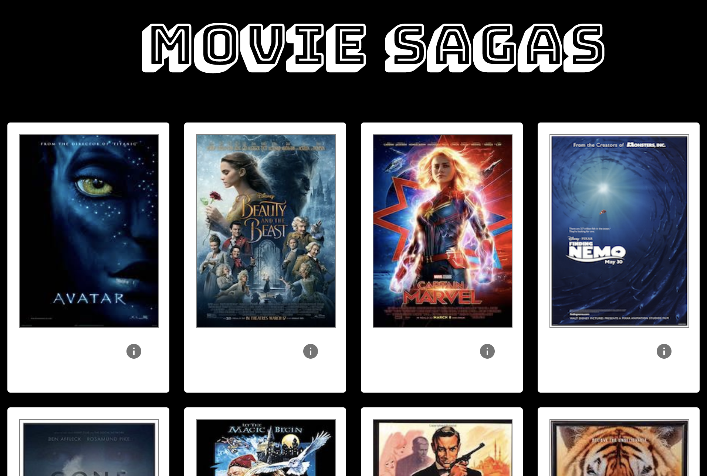
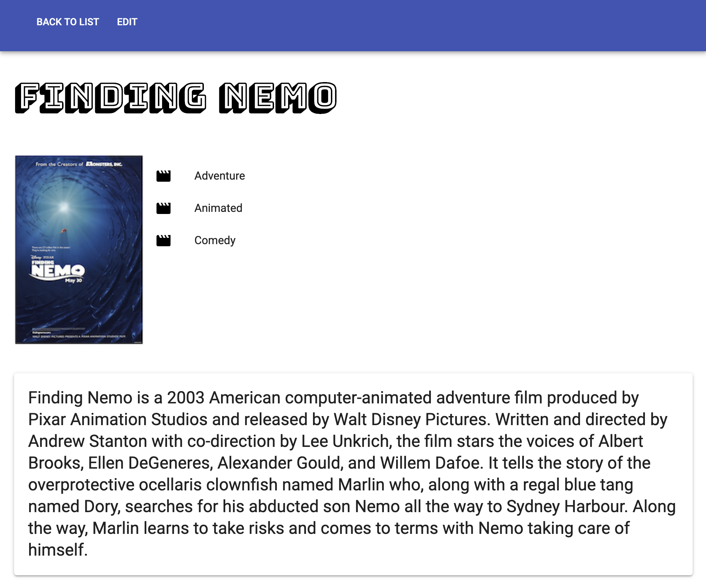
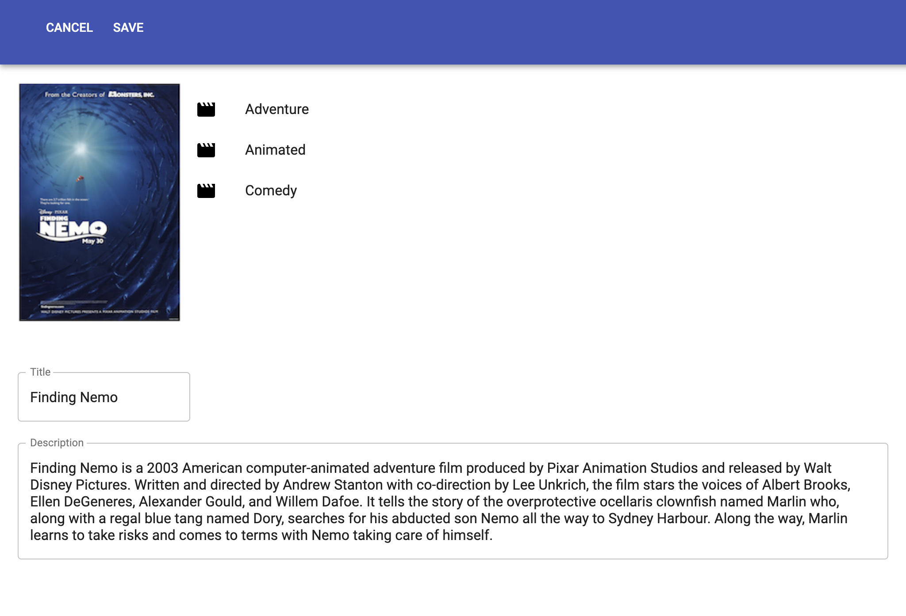

# Movie Sagas

## Description

This is a React movie application. A user can see movies that exist in the database. They are also able to see a detailed view for each individual movie, including genres associated with that movie. The user can also edit each movie's information. The user will be taken through 3 views (movie list page, details page, and edit page) and have the option to go back to the home or previous page if desired.

## Prerequisites
- Node.js

## Screen Shot

## Getting Started
- npm install
- npm run server
- npm run client

## Usage
1. User begins on the home page which shows the poster for every movie in the database. From here, a user is able to click the info icon in order to go to the details page to learn more about the movie.
2. The user will be taken to a new view where they can see the movie title, description, and associated genres, if there are any. The user has the option to navigate back to the movie list page by clicking "Back to List" or to edit the movie details by clicking "Edit."
3. If the user clicks "Edit", they will be taken to a new view where there are two input fields: (1) Title, (2) Description. The fields will show the current information in the database but the user is able to update one or both of the fields and click "Save" in order to update the database. Once the user clicks "Save", they will be navigated back to the details page to see their updates.
4. If the user does not wish to edit either of the fields, they may simply click "Cancel" and they will be routed back to the details page without the database updating.

## Built With
- React
- Redux
- Redux-Saga
- Axios
- JavaScript
- Node.js
- Material-UI

## Acknowledgement
Thank you to Prime Digital Academy for equipping me with the knowledge and tools to create this application.
